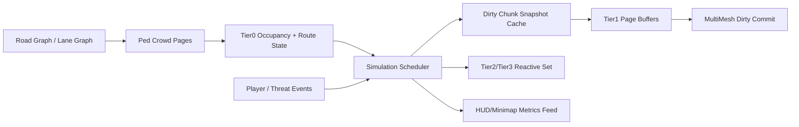

# 高密度行人 Crowd 架构研究（2026-03-13）

## Executive Summary

这轮问题已经不是“把几个参数调快一点”，而是 `godot_citys` 当前 crowd runtime 的核心形态与 `M9` 的 `10x` 人口目标正面冲突。业界在做大量 NPC / crowd 时，主流路线并不是“让更多完整 NPC 跑得更快”，而是把表示层、仿真层、调度层一起改成 data-oriented、page-based、tiered runtime：远景是廉价批量表示，近景才是少量高保真 agent，且所有昂贵步骤都必须按 chunk/page 增量提交，而不是每帧全量重建 [1][2][3][4][5][6][7][8][9]。

对本仓库而言，当前 `M9` 的产品要求不应该退化，但也不能再靠继续补丁去赌红线。更合理的路线是开两阶段：`M10` 先把 crowd 核心从“每帧全量扫描 + 全量排序 + 全量快照重建 + 全量 MultiMesh 重写”改成“page runtime + dirty scheduler + dirty snapshot + dirty render commit”，先让 `REQ-0002-016` 和 `16.67ms/frame` 同时成立；`M11` 再把近景真实模型、death visual、inspection、violent reaction 这些高保真行为稳稳压在新 runtime 之上，而不是继续让它们和高密度 Tier 1 争主线程预算 [10][11][12][13][14][15]。

## Key Findings

- **业界共识不是“全员完整 NPC”，而是分层 crowd runtime**：Unreal Mass、Unity ECS/Burst、经典 crowd LOD 研究都在强调同一件事，海量实体必须拆成数据层、表现层、近场高保真层，不能让每个个体都长期占用完整 Actor/Node/AI 成本 [3][4][5][6][7][8][9]。
- **当前仓库真正的瓶颈不是渲染 draw call，而是 CPU 侧全量 crowd pipeline**：`CityPedestrianTierController.update_active_chunks()` 每帧遍历全部 active states、做 reaction、做距离排序、清空并重建 chunk snapshots；`CityChunkRenderer` 再把所有 mounted chunk 全量提交给 crowd renderer；`CityPedestrianCrowdBatch` 继续整批重写 `MultiMesh` transforms。这是典型的 O(N) 到 O(N log N) 全量帧循环，在 `540/600` 级别下必炸 [11][12][13][14]。
- **当前工作区之所以守线，是靠把密度退回去**：2026-03-13 fresh 本地运行显示，`tests/world/test_city_pedestrian_density_order_of_magnitude.gd` 在 warm traversal 只有 `tier1_count = 54` 就失败；而同一工作区的 `tests/e2e/test_city_pedestrian_performance_profile.gd` 与 `tests/e2e/test_city_runtime_performance_profile.gd` 仍能 `PASS`，分别给出 warm `wall_frame_avg_usec = 12989` 与 `15699`。这说明当前仓库的真实状态不是“已经兼得”，而是“守住红线靠降低人口” [16][17][18]。
- **`M10` 的主战场必须是 Tier 1 runtime，不是继续堆 Tier 2/Tier 3**：如果把 `10x` 人口主要实现成更多近景骨骼角色或更多 reactive agent，性能会比现在更糟；必须优先把大量人口留在 page-local、低频、批量、增量提交的 Tier 0/1 [1][5][6][7][10]。
- **HUD / minimap / debug 已经不是主因，但必须继续解耦**：这条链路目前已经被限频止血，不再是第一热点；不过它仍绑定在 `CityPrototype.update_streaming_for_position()` 上，后续必须和 crowd core 进一步分离，避免未来 crowd 变更把 UI 重新带热 [15][17][18]。

## Detailed Analysis

### 1. 业界大量 NPC / Crowd 的常见架构

Unreal Mass 的设计非常直白：它把 simulation 建成 data-oriented ECS，核心对象是 `Entity`、`Fragment`、`Archetype` 和 `Processor`，目标就是让大量实体按共享数据布局成批处理，而不是一个个厚 Actor 去跑 [5]。Mass Representation 进一步把“仿真”和“显示”拆开，支持不同 LOD、不同 viewer 下的显示方式，并区分高保真 Actor 与更廉价的 instanced/static representation [6]。Mass Crowd 则把 crowd 特定数据进一步落到 lane tracking、LOD collector、client bubble 等 crowd 专项结构里 [7]。

Unity ECS 的官方口径也一样：Data-Oriented Technology Stack 通过按类型和内存布局把数据放进 cache-friendly chunks，再把系统放进 Job System/Burst 里批处理，从而把同样的 CPU 预算转成更多实体吞吐 [3][4]。这里的关键不是“用了 ECS 就自动变快”，而是它把海量实体的更新模型，从面向对象的离散节点调用，改成了批量、线性、可并行的数据遍历 [3][4]。

Godot 虽然没有内建一套和 Unreal Mass/Unity ECS 等价的游戏层 ECS，但官方文档给出的性能边界非常清楚：`MultiMesh` 适合一次性画大量实例，但没有 per-instance frustum culling，因此必须按空间分块来用；SceneTree 本身不是线程安全热区，想做后台准备应尽量停留在纯数据或 server API 层，避免跨线程改节点树 [1][2]。这意味着 Godot 做大规模 crowd 的正确路线不是“继续堆 Node3D”，而是“数据层自己分页，渲染层按 page/chunk 批量提交，近景少量节点单独管理”。

经典 crowd 研究对这个方向提供了理论支撑。Simulation LOD 早就指出，角色的几何、动作和行为都应该按重要度分层，不该让远景个体长期支付与近景相同的仿真成本 [8]。Continuum Crowds 则把超大规模 crowd 的远场行为进一步抽象成统计流，而不是“每个体都有完整决策” [9]。这对本项目的含义很明确：你要的是“城市里有很多人”，不是“全城 600 人都在逐帧做完整 agent 决策”。

### 2. 当前仓库的 crowd 架构为什么和 M9 冲突

当前游戏主循环仍以 `CityPrototype._process()` 驱动 `update_streaming_for_position()`，在同一条链路上推进 chunk streaming、crowd、HUD、debug overlay 和 minimap 采样 [15]。进入 `CityChunkRenderer._update_pedestrian_crowd()` 后，会把当前 active chunk window 和 player context 直接送给 `CityPedestrianTierController.update_active_chunks()` [12]。

真正的问题出在 `CityPedestrianTierController.update_active_chunks()`：它先 `sync_active_chunks()`，再取出全部 `active_states`，然后对所有 active state 进行 `queue_step -> step -> ground_state -> update_reactions`，随后再对全部 active states 按距离排序，并清空 `_chunk_render_snapshots` 后重新把 tier1/tier2/tier3 状态塞回各 chunk snapshot [11]。这一步同时包含：

- 全量 active-state 遍历
- 全量 reaction 决策
- 全量距离排序
- 全量 chunk snapshot 清空重建

随后 `CityChunkRenderer` 仍会遍历所有 mounted chunk，把对应 snapshot 整块推给 `apply_pedestrian_chunk_snapshot()` [12]。而 `CityPedestrianCrowdRenderer.apply_chunk_snapshot()` 又会：

- 对 Tier 1 调 `configure_from_states()`
- 对 Tier 2 / Tier 3 做节点同步

其中 `CityPedestrianCrowdBatch.configure_from_states()` 的写法还是：

- `multimesh.instance_count = states.size()`
- 然后对全部 state `set_instance_transform()`

这意味着即使某个 chunk 只有 1 个 Tier 1 行人动了，也会把这个 chunk 的 Tier 1 buffer 整批重写 [13][14]。

这套结构在 `ped_tier1_count ≈ 50~60` 时还能勉强过线，但只要恢复到 `REQ-0002-016` 期待的 warm `540` / first-visit `600` 量级，就会把 O(N) / O(N log N) 的全量 CPU 成本放大一个数量级。`docs/plan/v6-pedestrian-handplay-closeout.md` 记录的高密度 profile 已经说明过这一点：当数量级 uplift 成立时，warm `wall_frame_avg_usec` 会回退到 `32259`，runtime warm 会回退到 `35807`，热点集中在 `crowd_update_avg_usec` [10]。

### 3. 当前 fresh 证据链说明了什么

2026-03-13 我在当前工作区 fresh 顺序跑了三组关键验证：

- `tests/world/test_city_pedestrian_density_order_of_magnitude.gd`
- `tests/e2e/test_city_pedestrian_performance_profile.gd`
- `tests/e2e/test_city_runtime_performance_profile.gd`

结果很干脆：

- 数量级测试失败，warm 只有 `tier1_count = 54`
- pedestrian profile 通过，warm `wall_frame_avg_usec = 12989`
- runtime profile 通过，warm `wall_frame_avg_usec = 15699`

再结合当前工作区尚未提交的临时回退：

- `CityPedestrianConfig.gd` 把 `max_spawn_slots_per_chunk` 从 `56` 回退到 `20`
- `CityPedestrianConfig.gd` 把 edge slot contract 回退到 `0/1/2/3`
- `CityPedestrianQuery.gd` 把 `lane_slot_budget` 从 `floor(lane_length / 10.0)` 回退到 `floor(lane_length / 90.0)`
- `CityPrototype.gd` 给 HUD 加了 `50ms` 限频

结论只有一个：当前仓库不是“已经优化出兼得架构”，而是“性能过线依赖于密度退回去” [15][16][17][18]。

### 4. M10：不降密度的性能恢复，应该怎么改

`M10` 不该继续把注意力放在“spawn slots 再抠一点”或“HUD 再少刷一点”，而要把 crowd runtime 拆成四层。

第一层是 **Crowd Page Runtime**。当前 page 已经有雏形，但 page 内仍是 state list + 每帧全量取出。`M10` 应把 page 变成稳定的 crowd data 容器：固定 page roster、固定 spawn slot 索引、固定 chunk-local Tier 1 instance slot、以及单独的 dirty bitset。这样 page 只在 mount/unmount、promotion/demotion、death visual begin/end 这类事件上改结构，而不是每帧推倒重来。

第二层是 **Simulation Scheduler**。不是所有 active state 都该每帧跑一整套逻辑。应改成：

- Tier 3：逐帧或高频
- Tier 2：固定子集高频
- Tier 1：分片轮转，低频 step
- Tier 0：纯 occupancy / continuity，不参与逐帧仿真

与此同时，reaction 也不应该对全体 state 每帧重算。更合理的是把 projectile / gunshot / casualty / explosion 先映射到 chunk/page/lane corridor，再只更新受影响 page 的局部候选集合。

第三层是 **Dirty Chunk Snapshot Cache**。当前 `_chunk_render_snapshots.clear()` 是结构性问题。`M10` 应保留每个 chunk 的长期 snapshot 容器，只更新发生变化的 tier lists、counts 和 dirty ranges。排序也不应该对全部 active states 全量做；Tier 3 候选只需要局部选择，Tier 2 也只需要维护 nearfield ring，不需要拿整个 active window 排一次全局距离序。

第四层是 **Dirty Render Commit**。Tier 1 MultiMesh 不能再每帧 `instance_count + set_instance_transform(all)`。更合理的是：每个 crowd page 固定一段实例区间，只在 dirty indices 上重写 buffer；若 Godot 层 API 不足，再至少做 page-local full rewrite，而不是 mounted-chunk 全量 rewrite [1][2]。这一步是 `M10` 最关键的渲染侧收益点。

### 5. M11：在新 crowd core 上重新托住高保真近景

`M10` 解决的是“高密度为什么炸”，`M11` 才解决“高密度之上如何继续保住 M8/M9 的近景质量”。

`M11` 的原则应该是：Tier 2 / Tier 3 的真实模型、walk/run/death、inspection、violent reaction 都继续保留，但近景高保真集合必须与 Tier 1 大人口完全脱钩。也就是说：

- Tier 1 page buffer 只负责存在感，不直接承载真实骨骼模型
- Tier 2 / Tier 3 promotion 变成事件驱动、固定 hard cap
- death visual 成为和 live roster 脱钩的 transient system，避免 density 回来后再次被 tier rebuild 吞掉
- inspection / violent threat 只作用在 nearfield set，不向 Tier 1 全量广播

换句话说，`M11` 不是再去“优化一遍 M9”，而是让 M9 的 hand-play 功能运行在一个已经支持高密度的 crowd substrate 上。这样你既不需要退化人口，也不需要退化近景视觉和玩法反馈。

### 6. 对整个游戏架构的建议排序

从整机架构看，当前项目已经在 `v4/v5` 把 world generation、terrain、road surface、streaming mount setup 压回过一次红线。现在 crowd 要做的，不是另起炉灶，而是复用这套方法论：

1. 先在 crowd 内部建立新的 page/buffer/runtime 分层。
2. 保持 chunk streaming 仍只负责窗口管理，不负责 crowd 每帧全量重建。
3. 把 HUD/minimap/debug 变成 crowd metrics 的消费者，而不是同帧生产者。
4. 只有在 GDScript + MultiMesh dirty page 已经逼近极限时，才考虑把最热 inner loop 下沉到 GDExtension。

这里我有一个明确判断：如果 `M10` 还想继续停留在“TierController 大函数里打补丁”，它大概率只会得到一轮短暂变绿，然后在下一次人口/视觉需求上再次失控。这个判断来自本地代码结构，而不是单纯的外部资料类比 [10][11][12][13][14][15]。

## Areas of Consensus

- 海量 crowd 需要 **分层表示 + 分层仿真 + 分层调度**，不能人人都享受近景 agent 契约 [3][5][6][8]。
- 远景 / 中景 crowd 更适合 **page-based batched representation**，而不是海量独立节点 [1][5][6][7]。
- 近景高保真必须是 **固定预算、事件驱动** 的稀缺集合，而不是从高密度 Tier 1 自然外溢 [6][7][8]。
- Godot 里想守住红线，后台准备必须留在 **纯数据 / server API**，不要跨线程碰 SceneTree [1][2]。
- 当前仓库若想兼得 `REQ-0002-016` 与 `16.67ms/frame`，需要的是 **架构级重写 M10**，不是再调一轮密度参数 [10][11][12][13][14][15]。

## Areas of Debate

- **Tier 1 是否继续使用 MultiMesh，还是升级成更像 impostor/BRG 的表示**：基于当前项目风格和 Godot 工具链，先做 page-local MultiMesh dirty commit 最务实；只有这条路仍不够时，再考虑更激进的 impostor 或 GDExtension [1][2]。
- **M10 是否立即引入多线程 crowd prepare**：从架构上看值得预留，但第一阶段先把单线程全量路径改成增量 dirty runtime，往往比“先上线程”更稳。线程适合加速 page prepare，不适合掩盖 SceneTree 级全量提交流程 [2]。
- **远场是否要做统计流场**：Continuum Crowds 很适合更高数量级的总体人流，但当前 `540/600` 目标未必需要一步到位。先把 deterministic page runtime 跑稳，之后再决定是否加统计 density field [9]。

## Sources

[1] Godot Engine. *Optimization using MultiMeshes*. https://docs.godotengine.org/en/latest/tutorials/performance/using_multimesh.html （官方文档，高可信）

[2] Godot Engine. *Thread-safe APIs*. https://docs.godotengine.org/en/latest/tutorials/performance/thread_safe_apis.html （官方文档，高可信）

[3] Unity. *ECS for Unity*. https://unity.com/ecs （官方页面，高可信）

[4] Unity. *Burst User Guide*. https://docs.unity3d.com/Packages/com.unity.burst@1.8/manual/index.html （官方文档，高可信）

[5] Epic Games. *Overview of Mass Entity in Unreal Engine*. https://dev.epicgames.com/documentation/en-us/unreal-engine/overview-of-mass-entity-in-unreal-engine （官方文档，高可信）

[6] Epic Games. *Overview of Mass Representation in Unreal Engine*. https://dev.epicgames.com/documentation/en-us/unreal-engine/overview-of-mass-representation-in-unreal-engine （官方文档，高可信）

[7] Epic Games. *Overview of Mass Crowd in Unreal Engine*. https://dev.epicgames.com/documentation/en-us/unreal-engine/overview-of-mass-crowd-in-unreal-engine （官方文档，高可信）

[8] Jessica K. Hodgins, Deborah A. Carlson. *Simulation Levels of Detail for Real-time Animation*. Georgia Tech GVU Technical Report, 1996. https://repository.gatech.edu/items/36e25967-ac29-4e66-8d15-404861cc3910 （一手研究资料，高可信）

[9] Adrien Treuille, Seth Cooper, Zoran Popovic. *Continuum Crowds*. SIGGRAPH 2006. https://grail.cs.washington.edu/projects/crowd-flows/continuum-crowds.pdf （经典论文，高可信）

[10] 项目内文档：[`../plan/v6-pedestrian-handplay-closeout.md`](../plan/v6-pedestrian-handplay-closeout.md) （项目内一手计划/性能证据，高可信）

[11] 项目内代码：[`../../city_game/world/pedestrians/simulation/CityPedestrianTierController.gd`](../../city_game/world/pedestrians/simulation/CityPedestrianTierController.gd) （项目内一手代码，高可信）

[12] 项目内代码：[`../../city_game/world/rendering/CityChunkRenderer.gd`](../../city_game/world/rendering/CityChunkRenderer.gd) （项目内一手代码，高可信）

[13] 项目内代码：[`../../city_game/world/pedestrians/rendering/CityPedestrianCrowdRenderer.gd`](../../city_game/world/pedestrians/rendering/CityPedestrianCrowdRenderer.gd) （项目内一手代码，高可信）

[14] 项目内代码：[`../../city_game/world/pedestrians/rendering/CityPedestrianCrowdBatch.gd`](../../city_game/world/pedestrians/rendering/CityPedestrianCrowdBatch.gd) （项目内一手代码，高可信）

[15] 项目内代码：[`../../city_game/scripts/CityPrototype.gd`](../../city_game/scripts/CityPrototype.gd) （项目内一手代码，高可信）

[16] 项目内测试：[`../../tests/world/test_city_pedestrian_density_order_of_magnitude.gd`](../../tests/world/test_city_pedestrian_density_order_of_magnitude.gd) 与 2026-03-13 fresh 本地执行结果（项目内一手验证，高可信）

[17] 项目内测试：[`../../tests/e2e/test_city_pedestrian_performance_profile.gd`](../../tests/e2e/test_city_pedestrian_performance_profile.gd) 与 2026-03-13 fresh 本地执行结果（项目内一手验证，高可信）

[18] 项目内测试：[`../../tests/e2e/test_city_runtime_performance_profile.gd`](../../tests/e2e/test_city_runtime_performance_profile.gd) 与 2026-03-13 fresh 本地执行结果（项目内一手验证，高可信）

## Gaps and Further Research

- 这份结论目前仍以 headless + dummy renderer 的 regression baseline 为主；真实 GPU、真实手玩视角下，还需要补一次 camera-heavy profiling。
- 还没有 fresh 证明 `MultiMesh` dirty range commit 在 Godot 4.6 GDScript 下的极限上界；`M10` 实施时应先做一个最小 page-buffer prototype 再决定是否要下沉到 GDExtension。
- 还没有为“车辆 + 行人 + 爆炸 + police/wanted”建立统一的 event bus；本轮建议只先把 pedestrian crowd core 抽直。
